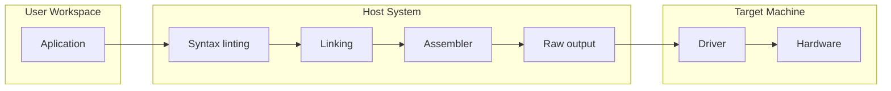

# Gama-X Programming Language (v0.1.0)

Gama-X is a modern intermediate programming language designed as a powerful alternative to traditional logic-less **DSLs (Domain-Specific Languages)** used in industrial automation and machine control systems.

It combines low-level efficiency with high-level logical capabilities, allowing developers to build complex machine workflows without sacrificing performance or determinism.

## Why Gama-X?

Traditional machine languages such as G-Code are primarily designed for sequential machine instructions and provide little to no support for advanced program logic.

Gama-X introduces a hybrid **Compiler–Interpreter** architecture that moves computational and logical overhead away from the target machine and into a preprocessing stage.

This approach enables:

- **Labels & Branching** — Organize programs into reusable execution paths.
- **Conditional Logic** — Execute instructions based on runtime conditions.
- **Arithmetic & Bitwise Operations** — Perform advanced calculations and binary manipulation.
- **Dynamic Variables** — Store and process symbolic values efficiently.
- **Deterministic Execution** — Generate predictable machine output suitable for real-time environments.

> **Note:** Gama-X programs are not native executables. They require a compatible runtime or machine driver capable of interpreting the generated output.

> **Note:** Gama-X is a logic-simulated language. All computations, logical evaluations, and control-flow decisions are processed during the pre-compilation stage on the host system. The target machine receives only the resulting execution data.

## Architecture

Unlike traditional interpreted machine languages, Gama-X separates program logic from machine execution.

By resolving logical operations before deployment, the runtime environment can focus exclusively on machine control rather than program analysis.

## Performance Considerations

The primary performance advantage of Gama-X comes from reducing runtime parsing and logical evaluation on the target hardware.

| Feature               | Traditional G-Code | Gama-X   |
| --------------------- | ------------------ | -------- |
| Logic Support         | None               | Full     |
| Runtime Parsing       | Required           | Minimal  |
| Conditional Execution | External           | Built-in |
| Determinism           | Limited            | High     |
| Machine Overhead      | Higher             | Lower    |

Rather than claiming a universal asymptotic complexity, Gama-X focuses on minimizing runtime overhead through preprocessing and optimized execution output.

This makes it particularly suitable for:

- CNC systems
- Industrial automation
- Embedded machine controllers
- Real-time manufacturing workflows
- Custom machine drivers

## Getting Started

To learn the language fundamentals, start with:

https://github.com/ABPD2001/gama-x/tree/main/wiki/basics.md

## License

See the repository for licensing information.

---

_Created by Abolfazl Pouretemadi._
