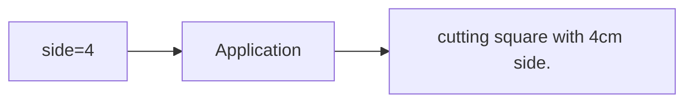
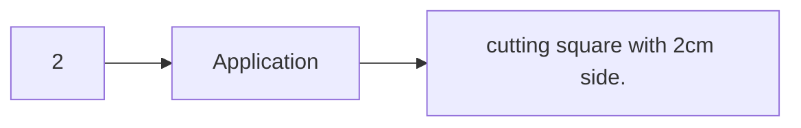
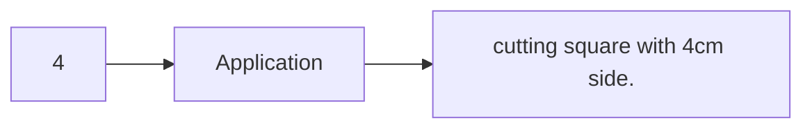

# Advanced features

In this section, we explore advanced features such as input files, included files, and the use of libraries that are locally managed on the system through the [Gama-X package manager]().

## Quick Menu

- **[External Input Files](#external-input-files)**
- **[Including Files](#including-files)**
- **[Importing Libraries](#importing-libraries)**

## External Input Files

_qouting from [wiki/instruction-set](https://github.com/ABPD2001/gama-x/blob/main/wiki/instruction-set.md) :_

"" Gama-X is designed to accept external inputs in a manner similar to conventional applications. These inputs are provided through files and are divided into two categories:

- **Argument-based input files:** These files follow a predefined syntax and format, allowing arguments to be defined as key-value pairs. The values can then be accessed and used within the program.

- **Numeric-value input files:** These files contain only a numeric value and do not require any specific syntax or formatting. ""

> _Note:_ type of input file doesnt matter, but its better to be text file.

### Argument-based input files

Argument-based input files use a key-value syntax, where the value is always a numeric value.

here is a example syntax:

```
key=value
```

and some examples:

```js
key1 = 10;
key2 = 999;
key3 = 104;
```

### Numberic-value input files

Numeric input files have no specific syntax or format; their content is simply treated as the value itself.

here is some examples:

```js
101;
```

```js
2001212;
```

```js
300320;
```

### why its important?

However, the main purpose of using these input files is to generate different outputs with varying values using the same application.

#### Exapmle

consider a CNC machine that needs to cut a square. Instead of modifying the program code every time a square with a different side length is required, a single input file can be used. The program reads the value from the file and uses it as the side length of the square to generate the output accordingly.




or





In this case, the program code itself does not change; only the input values are modified. This approach reduces the complexity of generating different outputs, since variations are achieved through input data rather than changes to the program logic.

## Including files

There are two ways to include a file into another file:

- **Using `.include`:** This manually adds the specified file into the current file.
- **During compilation:** The linker automatically links the required files together.

recommended to includes file at compile time, but it is possible to do it with `.include`.

### Examples

here is a example of including file with `.include`:

```
@ <-- file1.s -->

_test_:
    mov x,#1
    transpile
```

```
@ <-- main.s -->

.main _start
.include "./file1.s"
.end

_start:
    call _test_
    mov y,#1
    transpile
```

or simply `gx file1.s main.s -o output.out`.

## Importing Libraries

Similar to high-level languages, libraries can also be used in Gama-X.

These libraries are managed through local repositories on the user’s system and are handled by the [Gama-X Package Manager]().

### Example

Assuming these libraries exist in our repository and the program’s repository source has been configured, the available libraries include:

- `testlib`
- `standard-lib`

now we can use them by doing this:

```armasm
.import testlib
.import standard-lib
.main _main
.end

_main:
    @ rest of code...
```

## Next Step

if you still didnt check how to use `gx` (Gama-X binary file), read [wiki/gx-command]().
also you can check how to use `gxpm` (Gama-X Package manager), read [wiki/gxpm-command]().

## Author

by _Abolfazl Pouretemadi_.
