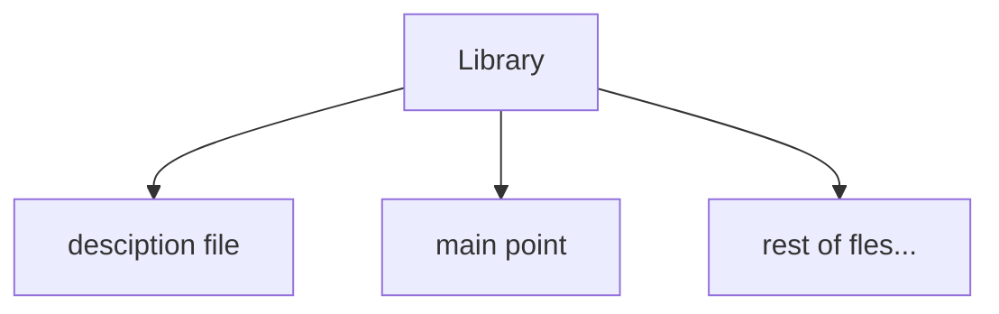
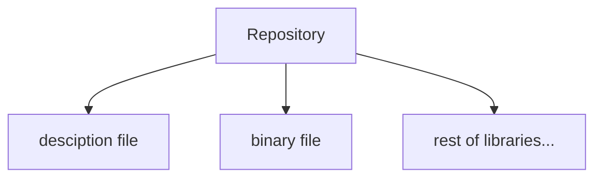

# `gxpm` Binary File

The Gama-X package manager is responsible for managing local offline repositories, organizing libraries, and handling related package management tasks.

## Quick Menu

- **[Basics and Structures]()**
- **[Configuration and Initializtaion]()**

## Basics and Structures

Before using the package manager effectively, it is important to understand several core concepts and structures. We will begin by exploring the library organization model and the hierarchy used for library management.

### Hierarchy of Libraries

There is two main measurement:

- **Library**: libraries are the smallest unit in this hierarchy. Each library is essentially a directory that contains a designated output file, known as the **main point**. During compilation, only this main point file is used by the linker/compiler. The rest of the directory exists primarily to organize and simplify access to the library's source files.

  each library includes:
  - _main point:_ main point is only file where linker of Gama-X at linking time directly accesses to it and links it.
  - _description file:_ a regular text file where package manager use it to display information for library.



- **Repositories**: repositories are locations where libraries are stored and managed as a collection. Each repository contains a binary index file that stores metadata about every library, including its properties and storage location. When a user requests a library-related operation, the package manager uses this index file to locate the requested library and perform the necessary action.
  - _binary file:_ all libraries properties stored in this file, package manager uses this file to manage and takes responsibility to user's request. this includes:
    - _path of library directory:_ path of library directory.
    - _main point relative path:_ relative path to library's directory to main point file.
    - _library name:_ name of library.
    - _version:_ version of library.
    - _description:_ description of library.
  - _description file:_ description file for repository itself.



### Management of Structure

In addition to the hierarchy structure, there are several rules and conventions for managing repositories. We begin with the following constraints:

- Each repository can exist anywhere; it is not required that all repositories reside in a single directory. However, their organization depends on the user’s preference.

- All libraries within a repository do not need to be stored in a single directory. However, it is recommended to place each repository in a dedicated directory containing its libraries, as this makes inspection and debugging significantly easier.

- The binary file associated with a repository must be located inside the repository’s directory.

### Management of Repositoires

Each repository contains the following properties:

- repository description
- repository name
- repository address

and each library contains the following properties:

- _path of library directory:_ path of library directory.
- _main point relative path:_ relative path to library's directory to main point file.
- name of library.
- version of library.
- description of library.

but about savinng storing them, we know libraries properties, stores on a binary file at their repository, but repositories, also stores on a binary file, but at local configuration space.

### Global Repository

Now that you understand how repositories and libraries are stored, it is important to note that during the initial setup, a repository is automatically created within the root-level configuration called **global**. This repository is shared among all users. Any user with root privileges can add or remove libraries from it, and these changes will be visible to all other users.

> _Note:_ woking with **global** repository for any operation, required root premision.

## Configuration and Initialization

there is two type of configuration:

- **Local configuration**: all settings created with user-level permissions are stored within the user’s file system environment.

  > _Note:_ local configurations applies on user's main directory.

- **Global configuration**: all settings created with root-level permissions are stored within the root file system environment.
  > _Note:_ global configurations applies on root configuration directory (like `/etc/gxpm` or `C:\\Program Files\gxpm`).

### Setting up

When running the package manager for the first time, you must execute the `gxpm setup` command to perform the initial configuration.
But, it is important to pass which flags to `setup` verb:

- `-l, --local`: sets up and initializes the local environment, including the configuration required for the user's local workspace.

- `-nl, --skip-locals`: performs a system-wide installation and configuration. In other words, it applies settings at the root/system level. Administrator privileges are required.

> **Important:** It is strongly recommended to first run `gxpm setup -nl` with root privileges to perform the global configuration, and then run `gxpm setup -l` as a regular user to initialize the local configuration. If all setup steps are performed entirely as either root or a regular user, you may encounter permission-related issues when using package manager commands later.

so, there is a example:

```bash
# Recommended way
sudo gxpm setup -nl # root premision required
gxpm setup -l # user primision required.

# also it is possible to configure all of it with:
sudo gxpm setup # this will cause premission-issue when using gxpm without root preimsion at user level.
# or
gxpm setup # this should fail, because cannot setup configuration of root with user premision.
```

### Reseting Configurations

In cases where serious issues occur within the configuration files or installation data, a complete reset may be the only solution. Fortunately, several levels of reset are available, all of which can be performed using the `gxpm reset` command.

levels of reset:

- `-r, --rage`: this reset level removes everything from the installation. In other words, after performing this reset, you must run `gxpm setup ...` again to reinitialize the environment.

  > _Note:_ on normal reset, global repository and repositories data file (local) are stay un-touched.

- `-l, --affect-local`: If the rage mode is not enabled, also reset the local settings.

**which times reset required?**

- When configuration files or repository binary storage files become corrupted due to segmentation or syntax errors.
- When a complete reinitialization of the system is required.
- When you need to ensure that no previous configurations have been applied to the system.

## Repository Configuration and Management
