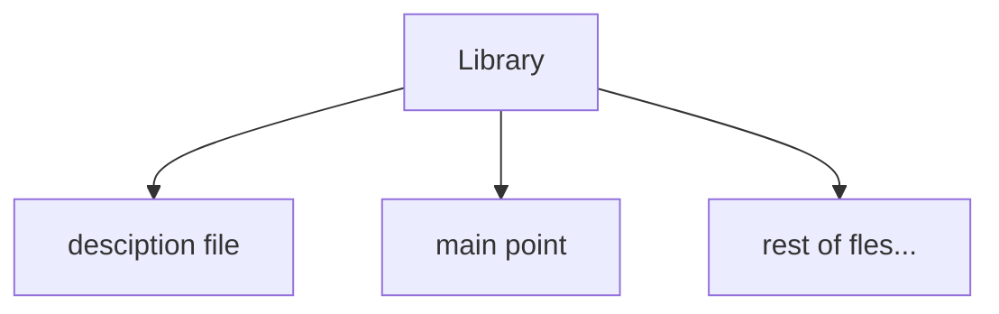
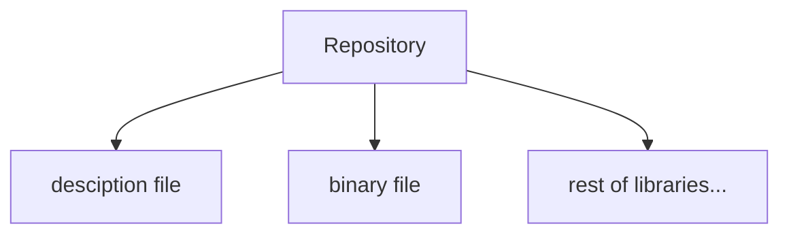

# `gxpm` Binary File

The Gama-X package manager is responsible for managing local offline repositories, organizing libraries, and handling related package management tasks.

## Quick Menu

- **[Basics and Structures](#basics-and-structures)**
  - **[Hierarchy of Structures](#hierarchy-of-structures)**
  - **[Management of Structures](#management-of-structures)**
  - **[Management of Repositories](#management-of-repositoires)**

- **[Configuration and Initializtaion](#configuration-and-initialization)**
  - **[Setting up](#setting-up)**
  - **[Reseting Configurations](#reseting-configurations)**

- **[Repository and Library Configuration and Management](#repository-and-library-configuration-and-management)**
  - **[Editing a Repository or Library](#editing-a-repository-or-library)**
  - **[Repository Initialization](#repository-initialization)**
  - **[Registering and De-registering Repoisitory and Library](#registering-and-de-registering-repoisitory-and-library)**
    - **[Registering](#registering)**

    - **[De-registering](#de-registering)**

  - **[Listing Repositories and Libraries](#listing-repositories-and-libraries)**
  - **[Exporting Repositories and Librarie](#exporting-repositories-and-libraries)**

  - **[Merging Repositories](#merging-repositories)**
  - **[Validating Repository](#validating-repository)**
  - **[Creating Library's New Mainpoint File](#creating-librarys-new-mainpoint-file)**

- **[Package Manager Infos](#package-manager-infos)**

- **[Next Step](#next-step)**
- **[Author](#author)**

## Basics and Structures

Before using the package manager effectively, it is important to understand several core concepts and structures. We will begin by exploring the library organization model and the hierarchy used for library management.

### Hierarchy of Structures

There is two main measurement:

- **Library**: libraries are the smallest unit in this hierarchy. Each library is essentially a directory that contains a designated output file, known as the **main point**. During compilation, only this main point file is used by the linker/compiler. The rest of the directory exists primarily to organize and simplify access to the library's source files.

  each library includes:
  - _main point:_ main point is only file where linker of Gama-X at linking time directly accesses to it and links it.
  - _description file:_ a regular text file where package manager use it to display information for library.



- **Repositories**: repositories are locations where libraries are stored and managed as a collection. Each repository contains a binary index file that stores metadata about every library, including its properties and storage location. When a user requests a library-related operation, the package manager uses this index file to locate the requested library and perform the necessary action.
  - _binary file:_ all libraries properties stored in this file, package manager uses this file to manage and takes responsibility to user's request. this includes:
    - _path of library directory:_ path of library directory.
    - _main point relative path:_ relative path to library's directory to main point file.
    - _library name:_ name of library.
    - _version:_ version of library.
    - _description:_ description of library.
  - _description file:_ description file for repository itself.



### Management of Structures

In addition to the hierarchy structure, there are several rules and conventions for managing repositories. We begin with the following constraints:

- Each repository can exist anywhere; it is not required that all repositories reside in a single directory. However, their organization depends on the user’s preference.

- All libraries within a repository do not need to be stored in a single directory. However, it is recommended to place each repository in a dedicated directory containing its libraries, as this makes inspection and debugging significantly easier.

- The binary file associated with a repository must be located inside the repository’s directory.

### Management of Repositoires

Each repository contains the following properties:

- repository description
- repository name
- repository address

and each library contains the following properties:

- _path of library directory:_ path of library directory.
- _main point relative path:_ relative path to library's directory to main point file.
- name of library.
- version of library.
- description of library.

but about savinng storing them, we know libraries properties, stores on a binary file at their repository, but repositories, also stores on a binary file, but at local configuration space.

### Global Repository

Now that you understand how repositories and libraries are stored, it is important to note that during the initial setup, a repository is automatically created within the root-level configuration called **global**. This repository is shared among all users. Any user with root privileges can add or remove libraries from it, and these changes will be visible to all other users.

> _Note:_ woking with **global** repository for any operation, required root premision.

## Configuration and Initialization

there is two type of configuration:

- **Local configuration**: all settings created with user-level permissions are stored within the user’s file system environment.

  > _Note:_ local configurations applies on user's main directory.

- **Global configuration**: all settings created with root-level permissions are stored within the root file system environment.
  > _Note:_ global configurations applies on root configuration directory (like `/etc/gxpm` or `C:\\Program Files\gxpm`).

### Setting up

When running the package manager for the first time, you must execute the `gxpm setup` command to perform the initial configuration.
But, it is important to pass which flags to `setup` verb:

- `-l, --local`: sets up and initializes the local environment, including the configuration required for the user's local workspace.

- `-nl, --skip-locals`: performs a system-wide installation and configuration. In other words, it applies settings at the root/system level. Administrator privileges are required.

> **Important:** It is strongly recommended to first run `gxpm setup -nl` with root privileges to perform the global configuration, and then run `gxpm setup -l` as a regular user to initialize the local configuration. If all setup steps are performed entirely as either root or a regular user, you may encounter permission-related issues when using package manager commands later.

so, there is a example:

```bash
# Recommended way
sudo gxpm setup -nl # root premision required
gxpm setup -l # user primision required.

# also it is possible to configure all of it with:
sudo gxpm setup # this will cause premission-issue when using gxpm without root preimsion at user level.
# or
gxpm setup # this should fail, because cannot setup configuration of root with user premision.
```

### Reseting Configurations

In cases where serious issues occur within the configuration files or installation data, a complete reset may be the only solution. Fortunately, several levels of reset are available, all of which can be performed using the `gxpm reset` command.

levels of reset:

- `-r, --rage`: this reset level removes everything from the installation. In other words, after performing this reset, you must run `gxpm setup ...` again to reinitialize the environment.

  > _Note:_ on normal reset, global repository and repositories data file (local) are stay un-touched.

- `-l, --affect-local`: If the rage mode is not enabled, also reset the local settings.

**which times reset required?**

- When configuration files or repository binary storage files become corrupted due to segmentation or syntax errors.
- When a complete reinitialization of the system is required.
- When you need to ensure that no previous configurations have been applied to the system.

## Repository and Library Configuration and Management

Each repository can be modified in several ways, including changing its properties, adding or removing libraries, validating its binary file, and performing other repository management operations, this is same with libraries.

### Editing a Repository or Library

The `gxpm edit <'repo'/'lib'>` command can be used to modify the properties of a library or repository.

options of `gxpm edit <'repo'/'lib'> <argument>` are:

- **Repository:** `repo`
  - `<argument>` is name or path of repository.
  - `-p, --path`: change path of repository.
  - `-n, --name`: change name of repository.
  - `-d, --description`: change descriptions of repository, (.txt file path).

- **Library:** `lib`
  - `<argument>` is name or path of library.
  - `-r, --repository`: repository of library (required).
  - `-V, --version`: change version of library (required).
  - `-p, --path`: change path of library.
  - `-n, --name`: change name of library.
  - `-d, --description`: change descriptions of library (.txt file path).
  - `-m, --mainpoint`: change relative path of main point of library.
  - `-dp, --dependecies`: change dependecies of library.

```bash
# Examples
gxpm edit repo my-repo -d ./new-description.txt
gxpm edit repo ./my-repos/my-repo -n repo-test
gxpm edit repo my-repo -n repo-test -d ./new-description.txt

gxpm edit lib my-lib -V 1.1.1 -dp dep1,dep2 -r my-repo
gxpm edit lib ../my-repo/my-lib -V 1.1.1 -m ./main.s -dp dep1,dep5,dep2 -r my-repo
```

> _Note:_ `-dp, --dependecies` is a array based argument.

### Repository Initialization

It is important to note that before a repository can be used, it must first be initialized using the `gxpm start` command. Until initialization is completed, the repository cannot be used because its configuration has not yet been set up; `gxpm start <argument>` is the syntax:

- `<argument>`: path of repository to initialize.

```bash
# Example
gxpm start ./my-repo
```

> _Better to know:_ `gxpm start ...` command just creates a binary file named `metadata.riff` at asked path, it doesnt register repository automatically and registering the repository must done with other commands.

### Registering and De-registering Repoisitory and Library

For the package manager to recognize and manage repositories and libraries, newly created items must be registered whenever they are added. This can be done using the `gxpm add` command. Likewise, repositories and libraries can be unregistered using the `gxpm remove` command.

#### Registering

`gxpm add <'repo'/'lib'> <argument>` is the syntax:

- `<'repo'/'lib'>`: select repository or library to work with it.
- `<argument>`: path of repository or library to register.

if target is a repository:

- `-n, --name`: name of repository to register.
- `-d, --description`: description of repository to register (.txt file path).

but if it is a library, then:

- `-n, --name`: name of library to register.
- `-d, --description`: description of library to register (.txt file path).
- `-V, --version`: version of library to register.
- `-r, --repository`: repository to register library into it.
- `-dp, --dependecies`: dependecies of library.
- `-m, --mainpoint-relative`: relative path to main point of library to register it.

```bash
# Examples
gxpm add repo ./my-repo -n my-repo -d ./my-repo/description.txt
# or
gxpm add lib ./my-repo/my-lib -n my-lib -r my-repo -V 1.0.0 -dp dep1,dep2 -m ./main.s
```

#### De-registering

`gxpm remove <'repo'/'lib'> <argument>` is the syntax:

- `<'repo'/'lib'>`: select repository or library to work with it.
- `<argument>`: path or name of repository/library.

if it was a library to remove (de-register) it:

- `-r, --repository`: from which repository.

```bash
# Examples
gxpm remove repo my-repo
# or
gxpm remove my-lib -r my-repo
```

### Listing Repositories and Libraries

In addition to modification operations, repositories can be listed, and the libraries contained within a repository can also be displayed, to achieve this, `gxpm list <'repo'/'lib'>` command must be used.

if you're listing repositories:

- `-l, --local`: list local repositories only (means global repository would'nt show).

but, if you're listing libraries:

- `-r, --repository`: which repository to list its libraries (it's requied).

```bash
gxpm list repo
gxpm list repo -l
# or
gxpm list lib -r my-repo
```

### Exporting Repositories and Libraries

By exporting, we simply mean copying the selected libraries or repositories to the specified destination, it is possible to acheive with `gxpm copy <'repo'/'lib'> <argument>`:

- `<'repo'/'lib'>`: select repository or library to work with it.
- `<argument>`: path or name of repositories/libraries.
- `-t, --target`: destination path.

if you're copying libraries:

- `-r, --repository`: from which repository.

```bash
# Examples
gxpm copy repo my-repo,repo2 -t ./copy-destination
# or
gxpm copy lib lib1,lib2 -r my-repo -t ./copy-destination
```

### Merging Repositories

Repositories can also be merged together to create a new repository. However, the resulting repository must be edited manually most of time, because merging creates new repository and registers it automatically, `gxpm merge <arguments> -n <repository name>` is the syntax:

- `<arguments>`: repositories to merge.
- `-n, --name`: name of output repository.

> **Important:** you can check repositories that are suitable with each other or not, this is possible with `gxpm mergable <arguments>`.

```bash
# Example
gxpm merge repo1,repo2,repo3 -n repo-out
# or
gxpm mergable repo1,repo2,repo3
```

### Validating Repository

one of most ways to which repository is making problem, it's to check if is repository valid with `gxpm validate` command, `gxpm validate <argument>` is the syntax:

- `<argument>`: path or name of repository to validate.

```bash
# Example
gxpm validate my-repo
gxpm validate ./my-repo
```

### Creating Library's New Mainpoint File

for those pepole where they need to customize their libraries manually, there is a way to updated library after applying changes on library's codes, `gxpm create-mainpoint` is the way, `gxpm create-mainpoint <argument> <options>` is the syntax:

- `<argument>`: path of directory to work with it.
- `-o, --output`: path of output file _(main point file)_.
- `-r, --repository`: if the library code itself is using other libraries, then it is required to set which repository to use it.
- `-nr, --ignore-repository`: do not use any repository for creating main point.
- `-nd, --ignore-dependecies`: do not process dependecies (if using any repository).

> _Note:_ if library codes does not use any external library (or in other words, _it is in-dependent_), then `-nr` flag must be used.

```bash
# Example
gxpm create-mainpoint ./my-repo/my-lib -o ./my-repo/my-lib/main.s -nr
gxpm create-mainpoint ./my-repo/my-lib -o ./my-repo/my-lib/main.s -r repo1
gxpm create-mainpoint ./my-repo/my-lib -o ./my-repo/my-lib/main.s -r repo1 -nd
```

## Package Manager Infos

at the end, use `gxpm version` to get version of package manager, and `gxpm help` to print package manager help message.

## Next Step

this is end of this documention, but you can check `gx` binary file at [wiki/gx-command](https://github.com/ABPD2001/gama-x/blob/main/wiki/gx-command.md) or Gama-X Language itself at [wiki/basics.md](https://github.com/ABPD2001/gama-x/blob/main/wiki/basics.md).

## Author

by _Abolfazl Pourtetemadi_.
